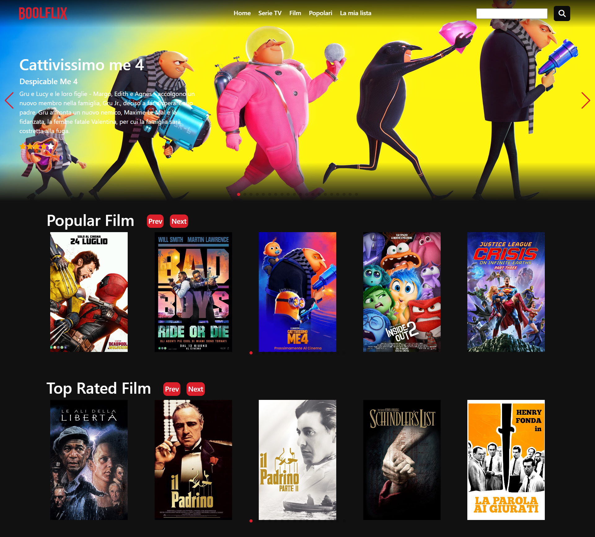

# Vite-boolflix

## Descrizione

Vite-boolflix è una web app simile alla famosa app Netflix, dove grazie a delle **API esterne fornite da The Movie Database** è possibile ricevere i dati dei film e serie TV più apprezzati e visti, con descrizione del film/serie TV, rating e molto altro. Nella mia applicazione è anche possibile ricercare un singolo titolo.

## Installazione

Per l'installazione, avendo utilizzato come tecnologie il gestore di pacchetti **VITE** con **VUE** e **Axios** per effettuare le chiamate al database, bisogna eseguire il seguente comando da terminale: **npm update**
